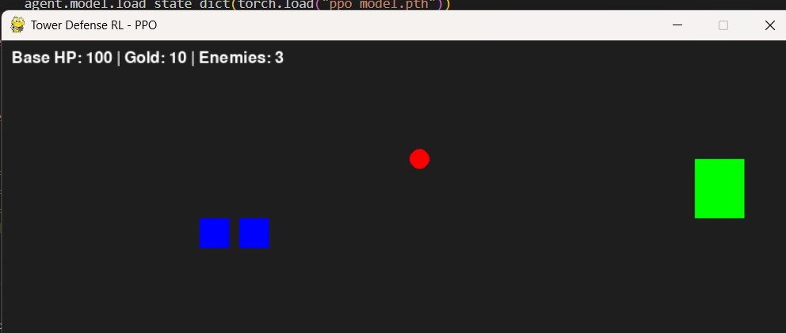

# Tower Defense RL – Projet Reinforcement Learning

## 🎯 Objectif du projet
L’objectif est de concevoir et entraîner un agent d’intelligence artificielle capable de jouer à un jeu **Tower Defense**, en utilisant des algorithmes de **Reinforcement Learning (RL)**.

L’agent doit :
- Protéger sa base contre des vagues d’ennemis
- Construire et placer des tours de manière optimale
- Maximiser les récompenses liées à : la survie de la base, l’élimination des ennemis et la gestion des ressources

---

## 🎮 Description du jeu Tower Defense
Le jeu simule un environnement stratégique où l’agent prend des décisions séquentielles :

- La base est l’objectif principal à protéger
- Les ennemis avancent le long d’un chemin vers la base
- Les tours tirent automatiquement sur les ennemis dans leur portée
- Le joueur/agent reçoit des ressources (gold) pour construire ou améliorer des tours
- Les vagues d’ennemis deviennent progressivement plus difficiles

---

### 🔹 État du jeu
Chaque étape (step) est représentée par un vecteur d’état :
- `base_hp` : Points de vie de la base
- `gold` : Ressources disponibles
- `towers` : Nombre et positions des tours
- `enemies` : Position et vitesse des ennemis
- `step_count` : Nombre de steps écoulés

---

### 🔹 Actions possibles

| Action             | Description                          |
|-------------------|--------------------------------------|
| Construire une tour | Placer une tour sur un emplacement libre |
| Ne rien faire       | Passer le tour                        |
| Améliorer une tour  | (Option future) augmenter sa puissance |

> Les actions sont discrètes pour PPO et stochastiques pour SAC.

---

### 🔹 Récompense (Reward)
- Positif : Élimination des ennemis, survie de la base
- Négatif : Base endommagée, ressources mal dépensées
- Multi-objectif : permet à l’agent de décider entre attaque et défense

---

## 🧠 Algorithmes RL utilisés

### 1️⃣ PPO – Proximal Policy Optimization
- **Type :** Policy Gradient (on-policy)
- **Principe :** Optimise directement la politique stochastique tout en limitant les mises à jour trop grandes pour plus de stabilité
- **Avantage pour Tower Defense :** Décisions efficaces pour la construction et placement des tours

**Diagramme conceptuel PPO :**

+-------------+
| État s_t |
+-------------+
|
v
+-------------------+
| Policy Network |
| (Actor) |
+-------------------+
|
v
+-------------+
| Action a_t |
+-------------+
|
v
+----------------+
| Environnement |
| TowerDefense |
+----------------+
|
v
+-------------+
| Reward r_t |
+-------------+
|
v
Mise à jour
Policy Network

---

### 2️⃣ SAC – Soft Actor-Critic
- **Type :** Actor-Critic off-policy
- **Principe :** Apprend un actor pour choisir l’action et un critic (Q-network) pour estimer les valeurs d’action
- **Avantage pour Tower Defense :** Gère bien les environnements complexes et changeants

**Diagramme conceptuel SAC :**

+-------------+
| État s_t |
+-------------+
|
v
+-----------------+ +-----------------+
| Actor Network |------>| Action a_t |
+-----------------+ +-----------------+
| |
v v
+-----------------+ +-----------------+
| Critic Q(s,a) |<------| Reward r_t |
+-----------------+ +-----------------+
|
v
Mise à jour
Actor + Critic

---

### 🔹 Différences clés PPO vs SAC

| Critère        | PPO                         | SAC                        |
|----------------|-----------------------------|---------------------------|
| Type           | Policy Gradient             | Actor-Critic off-policy    |
| Exploration    | Stochastique contrôlée      | Stochastique avec entropie |
| Stabilité      | Très stable                 | Flexible mais sensible aux hyperparamètres |
| Avantage TD    | Décisions rapides et sûres  | Exploration des stratégies complexes |
| Action         | Discrète                    | Stochastique (discrète ici) |

---

## 🔹 Architecture du projet

Tower Defense RL
├── agents/
│ ├── ppo_agent.py
│ └── sac_agent.py
├── env/
│ └── td_env.py
├── game/
│ ├── engine.py
│ ├── tower.py
│ └── enemy.py
├── training/
│ ├── train_ppo.py
│ └── train_sac.py
├── visualisation/
│ └── render.py
├── ppo_model.pth
└── sac_model.pth

---

## 🔹 Flux global

[ Environnement Tower Defense ]
↑
| Reward
|
[ Agent RL (PPO / SAC) ]
|
v
Action
|
v
[ Environnement Tower Defense ]

- La boucle continue jusqu’à la fin de l’épisode (base détruite ou nombre de steps atteint).  
- Les modèles PPO et SAC sont entraînés puis visualisés avec **Pygame**.

---

## 🔹 Visualisation

- Base : vert  
- Tours : bleu  
- Ennemis : rouge  
- Infos texte : Base HP, Gold, nombre d’ennemis  
- FPS : 10 (pour synchronisation avec l’entraînement)  

**Capture du jeu :**

  

> Rouge = ennemis, bleu = tours, vert = base

